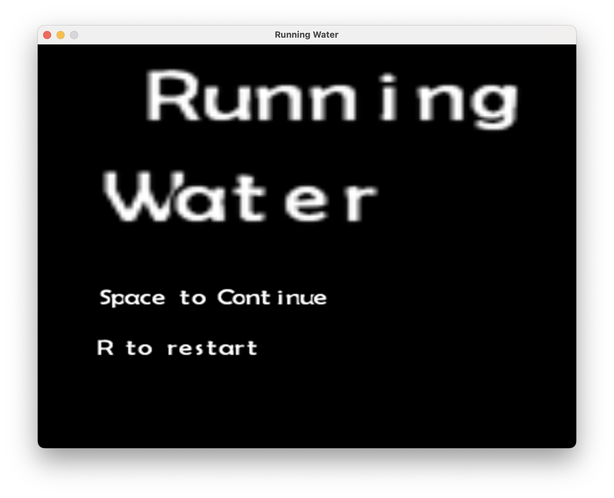

<div style="width:200px; height: 200px; border-radius:50%; overflow: hidden; background-color: white; border: 2px solid blue; margin-left: auto; margin-right: auto;">
    
</div>

<div align="center">

# Running Water

</div>

<div align="center">
    
    
    
</div>

A fun 2D platformer game where you play as a glass of water, applying force and rotation to navigate through the level all the while trying to avoid spilling your contents.

## Screenshots




## Gameplay

The objective of Running Water is to guide a glass of water through a series of challenging levels. You must carefully apply force and rotation to the glass to move it, while simultaneously preventing the water from spilling. The less water you spill, the higher your score!

## Features

*   **Unique Physics-Based Gameplay:** Master the art of controlling a wobbly glass of water.
*   **Challenging Levels:** Navigate through a variety of obstacles and puzzles.
*   **Scoring System:** Earn points based on how much water you have left at the end of each level.

## How to Play

*   **A and D Keys:** Apply force to the left and right.
*   **Arrow Keys:** Rotate the glass.

## Installation

1.  Clone this repository.
2.  Open the project in Xcode.
3.  Install the required SDL2 libraries.

On Mac:

```bash
$ brew install SDL2 && brew install SDL2_image && brew install SDL2_ttf
```

Then check the versions installed:

```bash
$ pkg-config --libs SDL2_mixer  
-L/opt/homebrew/Cellar/sdl2_mixer/2.8.1_1/lib -lSDL2_mixer -L/opt/homebrew/lib -lSDL2

$ pkg-config --libs SDL2_image
-L/opt/homebrew/Cellar/sdl2_image/2.8.8/lib -lSDL2_image -L/opt/homebrew/lib -lSDL2
```

If your versions are different, you'll need to update the "Other Linker Flags" in the Xcode target.
